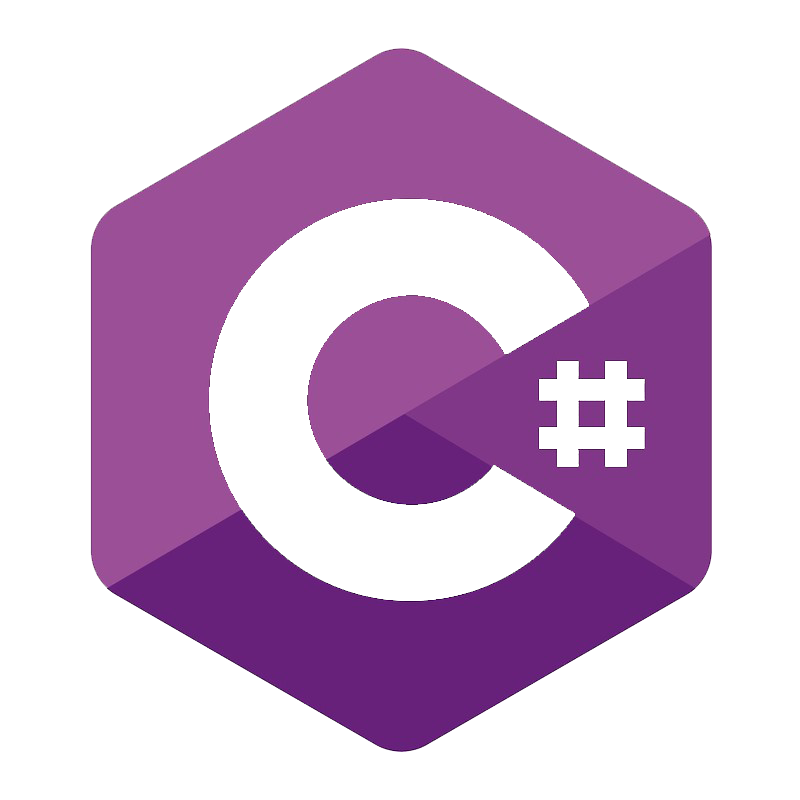

<h1 align="center">Olá 👋, eu sou o Gustavo!</h1>
<h3 align="center">E eu adoro trabalhar com solução de problemas</h3>

- 📚 Graduando em Ciências Exatas pela UFJF, com foco em **Ciência da Computação**
- 🌱 Atualmente estou estudando **Desenvolvimento Backend**
- 🐍 Tenho mais de 900 horas de experiência programando em **Python**
- 🖥️ Além de Python, conheço C#, Javascript, C/C++
- 📊 Tenho base também em análise e vizualização de **Dados**, que me auxiliam na resolução de problemas
- 📫 Fale comigo através do e-mail **gus.campos042@gmail.com**

<h1 align="left">Veja meus projetos publicados:</h3>

- <h2 align="left"> Biblioteca: Dopagens </h4>

Programas em **Python** que escrevi ao longo de mais de 1 ano, e uso na minha pesquisa de Iniciação Científica (CNPq) para gerar estruturas moleculares, disparar otimizações, colher dados, calcular propiedades e gerar visualizações, além de automatizar diversos outros processos. Documentação disponível no ReadTheDocs. Acesse o [projeto](https://github.com/gus-campos/dopagens).

- <h2 align="left"> AED: MovieLens </h4>

Análise exploratória de dados sobre o dataset de avaliações de filmes do site MovieLens, utilizando **Python, Pandas, Seaborn e Matplotlib no Jupyter Lab**, onde foi explorada a natureza das avaliações, as preferências do público, e a divergência de opiniões da audiência sobre as obras. Para mais detalhes acesse o [projeto](https://github.com/gus-campos/movielens-EDA).

- <h2 align="left"> Jogo: Survive Between Stars </h4>

Jogo space shooter que idelizei, dirigi e programei em **C#/Unity**, com música de minha autoria, e assets adapatados por mim. Conheça o jogo na [página da Itch.io](https://gus-campos.itch.io/survive-between-stars) onde é possível jogá-lo direto do navegador, e acesse o [repositório](https://github.com/gus-campos/Survive-Between-Stars) para conhecer a implementação e descobrir mais detalhes em seu README.

- <h2 align="left"> Jogo: Tanks War </h4>

Um jogo básico de guerra de tanques feito em JavaScript, utilizando a biblioteca gráfica THREE.js, na disciplina de Computação Gráfica na UFJF. Acesse o [repositório](https://github.com/gus-campos/tanks-war.github.io) (com instruções), e jogue-o na sua [github-page](https://gus-campos.github.io/tanks-war.github.io/). 

<h2 align="left">Conecte-se comigo:</h3>

<h3 align="left">Linguagens e Ferramentas:</h3>

 
   
   
   
   
  
  
  

  
